# Play or Pay website

Basic rule: admin can change anything.
Admin role can be granted via a console command, and also by another admin on members page.
All editable text fields support markdown for text format. There's a page with examples of how to use markdown.

## Pages:

#### Main Page

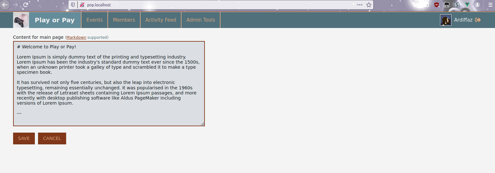
Content on the main page can be edited by admin. Markdown is supported here, so it means that it's possible to add any texts, links or even pictures.

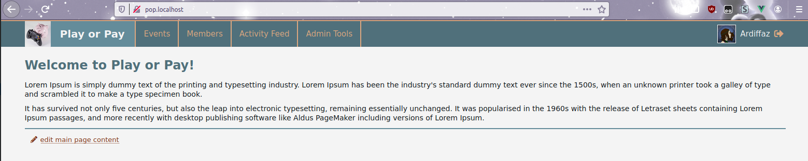
Link to edit is shown only to admins.

---

#### Members Page

 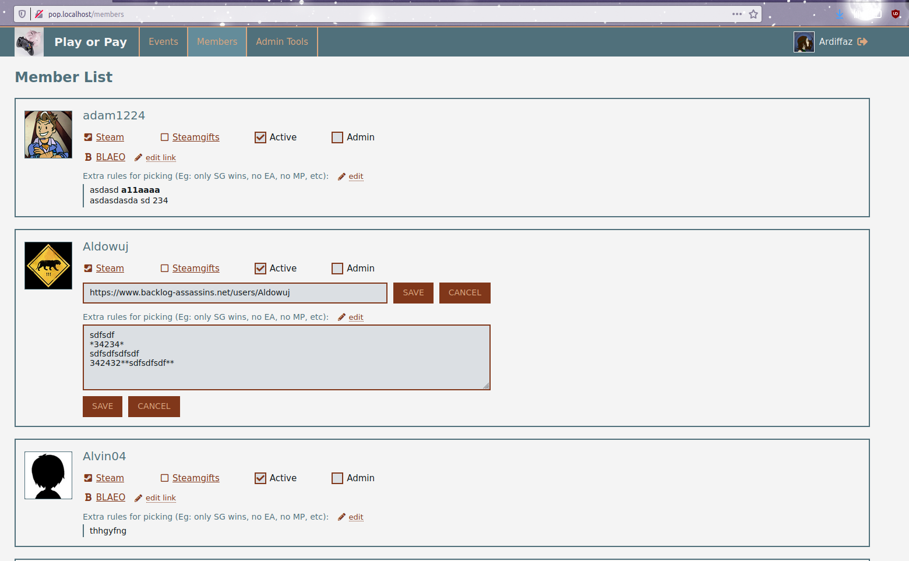
 
 List of users, options to edit their Blaeo links, extra rules, set activity and grant/revoke admin role.
Each member can edit their own Blaeo link and their own rules. It will be their default rules (so they don't need to fill the same text for each event, but they are still able to change rules for a specific event - on event's page.)
If user is not "active" at the moment of new event creation, they will not be added to the event, but admin can still add them later manually through "add participant" button on event page.

---

#### Admin Tools Page

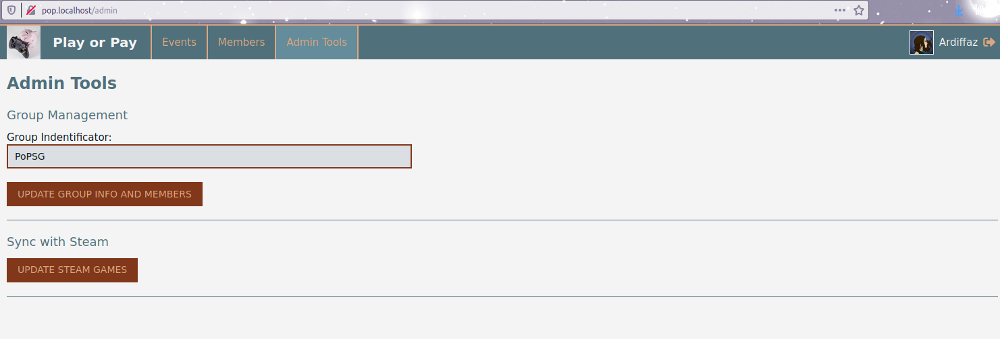

A simple page with a button to update group info and members list, and a button to import Steam games titles (with app ids).
Group identificator is taken from group page link, i.e. "PoPSG" is taken from "steamcommunity.com/groups/PoPSG".

---
 
#### Create New Event Page

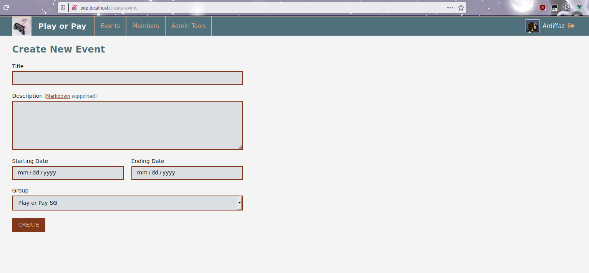

Create a new event page. Description is not mandatory. Starting and ending date don't affect anything, they serve only informational purpose.

---

#### List of All Events Page

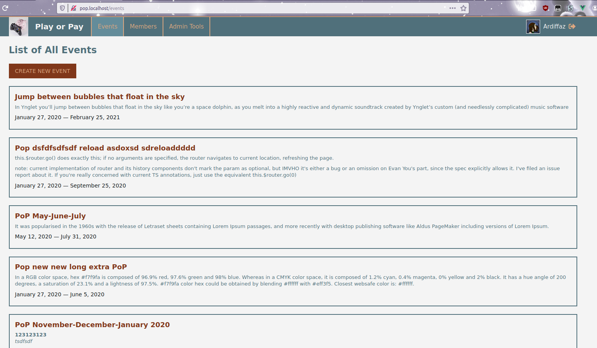

List of all created events, sorted by ending date.

---

#### Activity Feed Page

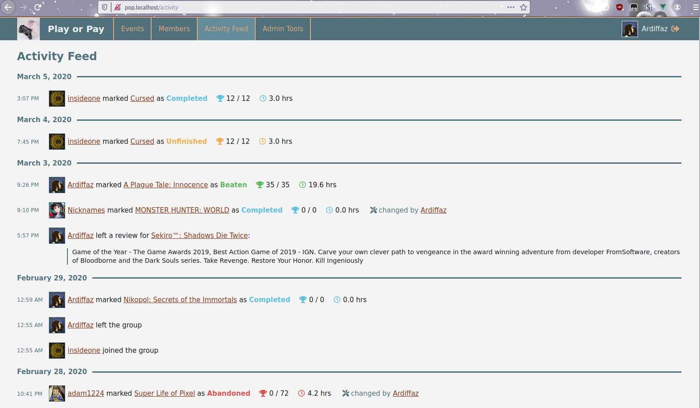

This page shows when there were made the following things:
- Someone changed the played status of their game. If this change was made by admin, it is written too.
- Someone joined or left the group.
- Someone left a review for one of their games.

The list is sorted by date. If there are too many entries, pagination is shown.

---

#### Event Page

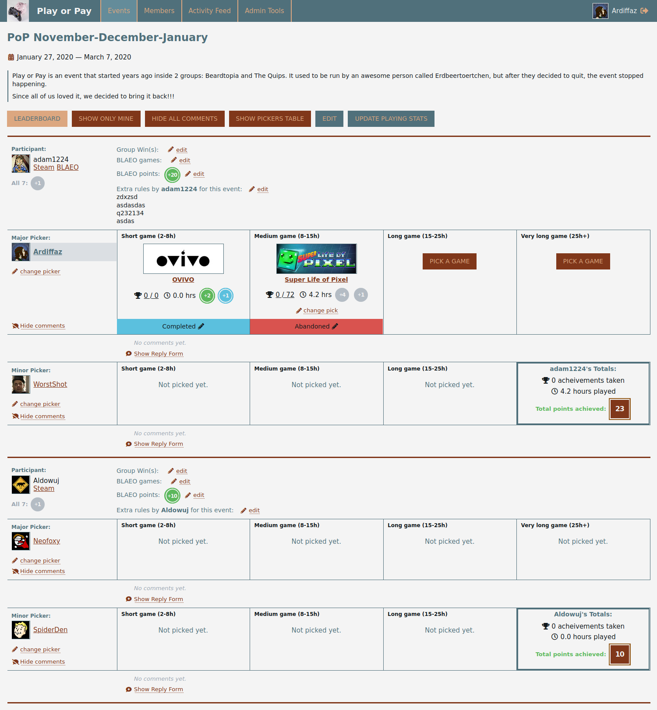

Basic features: view participant and their pickers, view and edit participant params (blaeo games, group wins) and their picks.
Right after the event is created, there is an option (for admin) to generate pickers, but also pickers can be set or changed manually (by admin).
Admin can add a new participant from a list of possible participants: these are users who are members of the group but not participants. Useful for people who were inactive in the moment of event creation or for people who joined group after the event was created.
Button to update playstats (playtimes and achievements), works for "profile features limited" games too. This button is available only for admins.

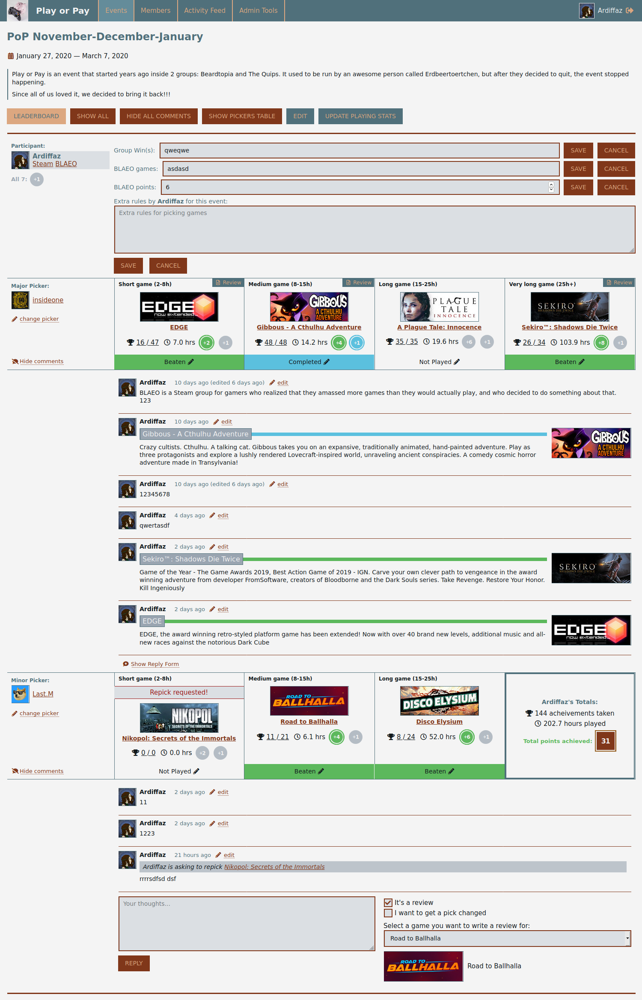

Participant fields can be edited (by participant themselves or admin). BLAEO points are edited by admin only.
Added comments can be seen by anyone, but new comments can be added only by the participant, the picker or an admin. Also comments can be edited, the time when the comment was updated will be also shown next to it. 
Pick status (unfinished/beaten/completed/abandoned) can be changed by participant or admin by clicking on it and selecting a new status in dropdown list.
Reviews and repick requests can be done via adding a comment by selecting a corresponding checkbox and then selecting a desired game for review or repick.
The corresponding game (picture + link, and title) is shown for review, alongside with a color-line to show the played status (green for beaten, blue for completed, etc). For repick-comments an additional row is shown, this comment (and this row) persists even after the game was repicked.
Points for finishing a game is also shown on this page: if the game is finished, then the point "medal" is colored (green for finishing game, blue for also completing it). Potential rewards are also shown, but their medals are grayed out. There are some help messages when hovering these medals, saying how these points were/can be obtained.

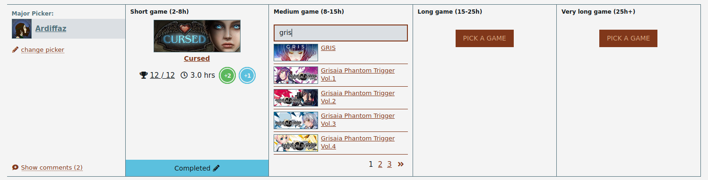

An example to show picking a game: click "Pick a game", then type a game name (or ID) and click on a game to choose it.
After the game is picked, it can be changed.

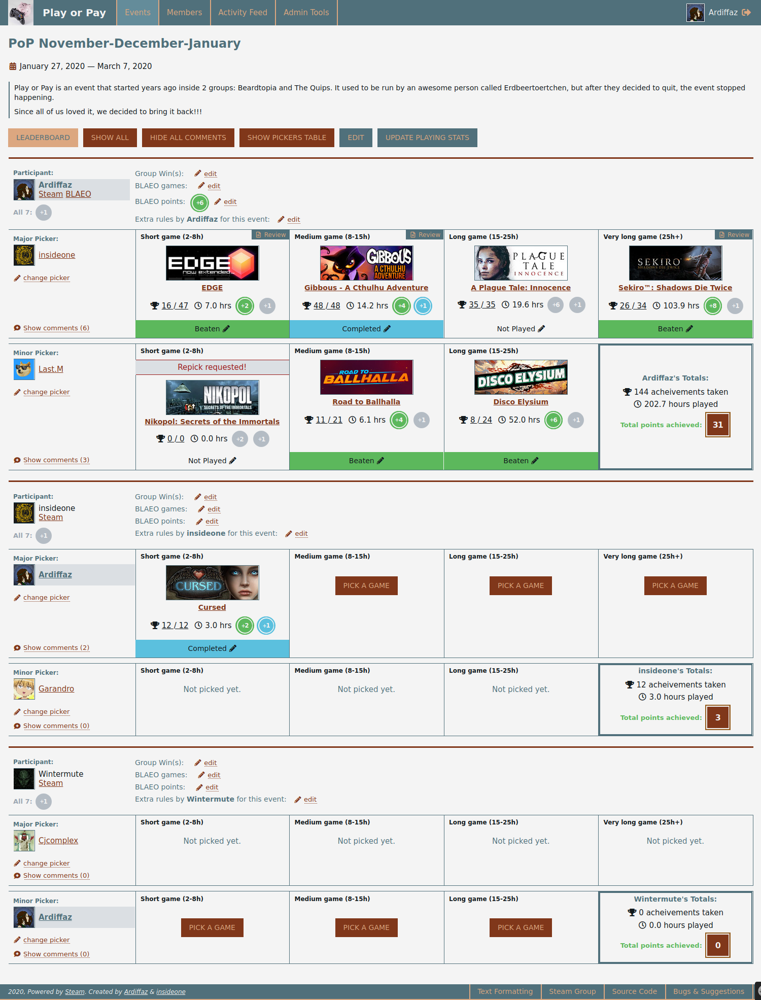

Example of "show only mine" filter. Three entries are shown: where the logged user is the participant, or minor picker, or major picker.
Since the logged user is admin, they can edit anything, but usual members won't see so many "edit" links.
The comments blocks are hidden on the screenshot for compact view, but they can be shown any time. When comment area is hidden, comment count is shown next to the link to show them.

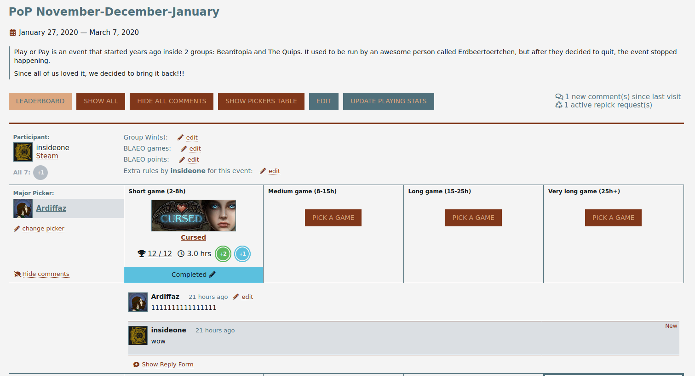

If there is at least one active repick request a notification is shown.
If there is at least one new comment since user's last visit a notification is shown. For this notification only those comments matters, where the current user is either participant or picker. For admins this notification shows all comments, because admin can participate in any "discussion" on this page.
New comments are slightly highlighted.

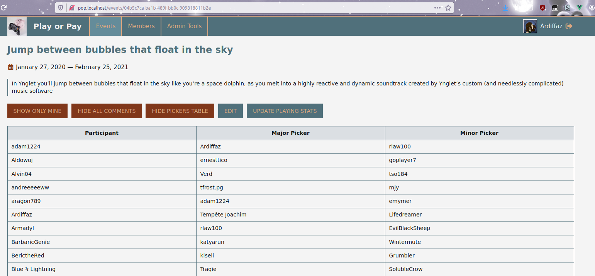

Pickers table is just a compact way to see all participant/pickers combo at once

---

#### Event Leaderboard Page

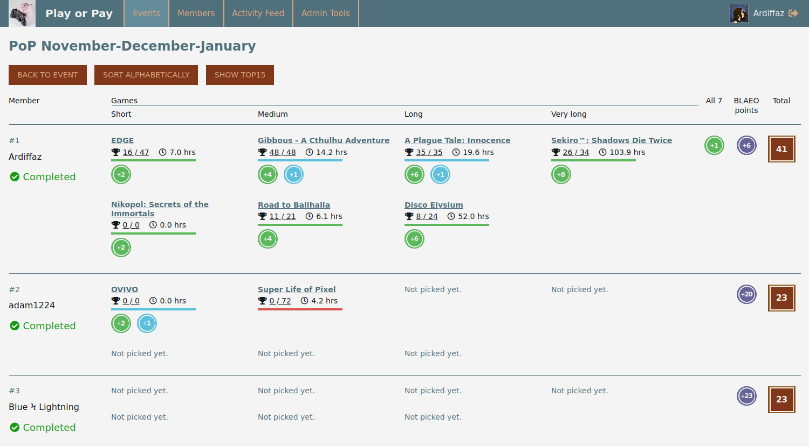

This page shows summary of playstats and points for playing games. Table can be sorted by alphabet or by points count.
When hovering points-medals, the hover hints are also shown, the same as on the event page.

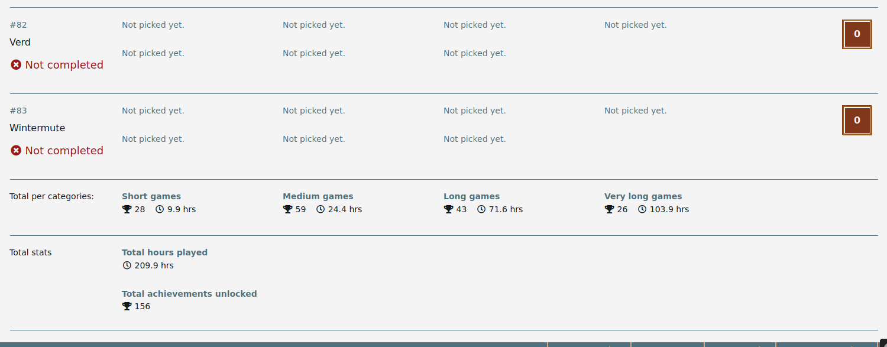

At the bottom the total stats are shown, they are calculated automatically.
"Completed" or "Not completed" status for each participant is decided bases on whether they have obtained at least 5 points or not.

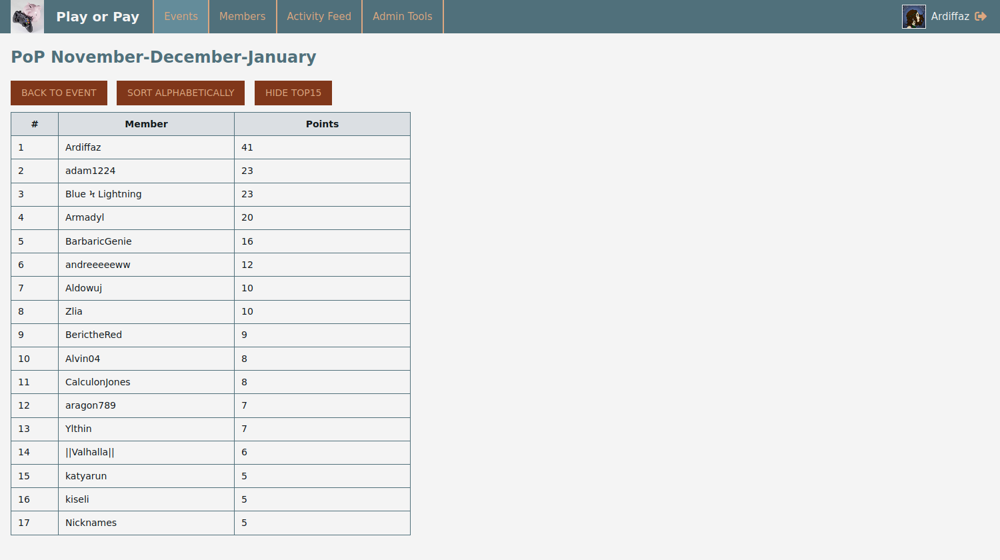

After clicking on "show top 15" this table is shown with top 15 participants, sorted by points. It takes into account that for the last place there may be a few contenders, having the exact same ammount of points.
